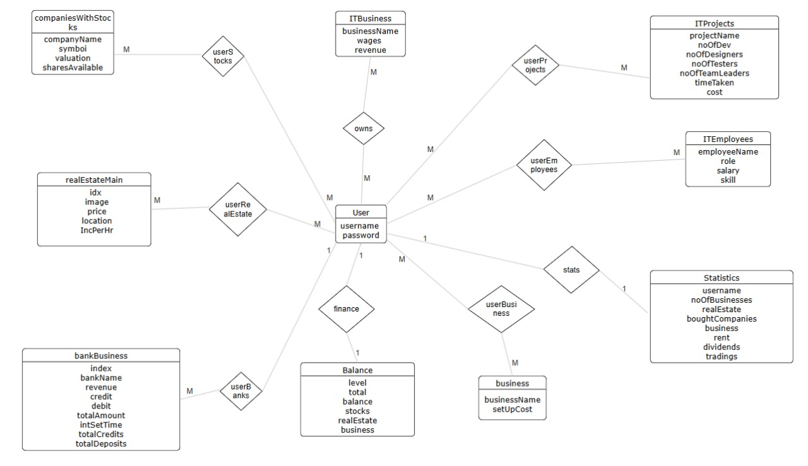
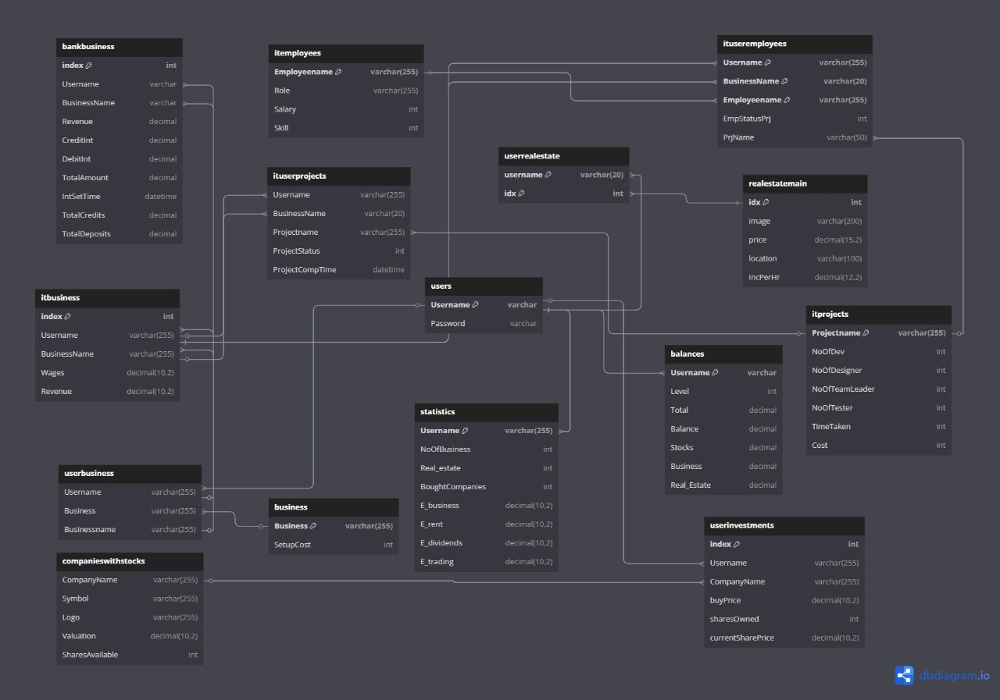

# GrowthSetHub - Business Simulator

## 1. Overview

**GrowthSetHub** is a full-stack business simulation game where users can start businesses, invest in stocks and real estate, and earn income over time. It’s designed with a fun and intuitive UI, simulating real-world money management strategies with a gamified approach.

---

## 2. Deployed Link

[👉 Visit GrowthSetHub Live](https://your-deployed-site-link.com)

---

## 3. Features & Screenshots

### Core Features:

* 🔐 **User Authentication**
* 💼 **Start & Upgrade Businesses**
* 🏠 **Invest in Real Estate & Stocks**
* 💰 **Live Balance Updates Every Minute** (via backend cron jobs)
* 📊 **Modern UI** with interactive cards and gradient visuals
* 🔁 **WebSocket integration** for real-time data (planned/future scope)
* 📈 **Stat Tracking**: Business growth, assets owned, and net worth

---

## 4. Tech Stack

### Frontend

* HTML
* CSS
* JavaScript

### Backend

* Node.js
* Express.js
* MySQL
* Cron Job (for scheduled balance updates)
* WebSockets
* RESTful APIs

---

## 5. Database Schema 

### ER Diagram


### Schema Diagram


---

```
